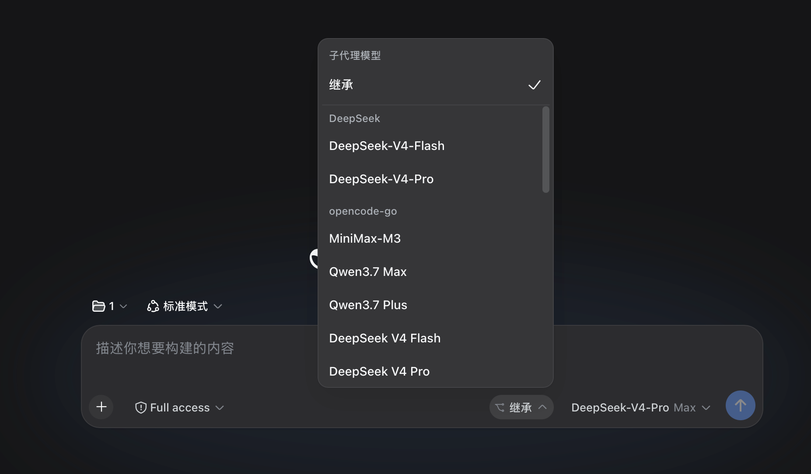

# dsh-subagent-toolsUI

在 DeepSeek Harness 的对话工具栏里，给子代理选模型。

默认先看 [英文说明](README.md)。



Harness 0.1.5 可以让主模型给子代理选模型，但那是全局名单，真正点选的还是主模型。Fork 默认也会跟着主模型走。

这个插件把选择放进当前对话。你可以继续继承主模型，也可以给这个会话里之后新建的子代理锁一个模型。主模型还是按任务选思考强度，不要自己编模型 ID。

## 能做什么

- 对话输入栏旁边有一个子代理模型选择器
- 可以继承主模型，也可以锁死后续子代理用的模型
- 普通派遣和 fork 都跟这个选择走
- 思考强度仍然每次单独选
- 如果 Harness 设置里开了子代理模型白名单，选择器只显示名单里的模型
- 会告诉主模型当前选择支不支持图片；说不清就按纯文本处理
- `persona`、工具过滤、spawn/fork 这些原来的参数还能用

改选择只影响之后新建的子代理。已经在跑的，还是创建时的模型。

## 安装

支持 DeepSeek Harness 桌面版 0.2.0-rc.2，也兼容 0.1.5 网页版。

### 桌面版

在左侧「插件」页面，用本地 `.tgz` 安装包安装。安装完成后退出并重新打开 Harness。

macOS 也可以使用桌面版自带的命令安装下载好的包：

```sh
"/Applications/DeepSeek Harness.app/Contents/Resources/runtime/cli/bin/dsh" plugin --profile desktop add /path/to/dsh-subagent-tools-ui-0.6.0.tgz
```

### 网页版

```sh
dsh plugin --profile web add github:MeSun424/dsh-subagent-toolsUI
```

装完重启 Harness，再打开对话。子代理选择器在输入框右侧，主模型选择器旁边。

如果以前的版本生成过 `standard-plus` preset，把默认 preset 改回 `standard`。官方子代理工具不用改。

## 怎么用

1. 打开对话，看输入框旁边的工具栏。
2. 保持「继承」，或者给后续子代理选一个模型。
3. 随时可以改，只有下一次新建的子代理会换模型。

主模型创建子代理时可以带 `reasoning_effort`。只能用当前模型公布过的档位，比如 DeepSeek V4 Flash 上的 `off`、`high`、`max`。

## 和实验性 Agent Teams 共存

装了 `@deepseek-ai/dsh-experimental-agent-team-profile` 之后，Agent Teams 会在团队成员作用域里用同名工具顶掉官方的 `send_message`、`list_agents`、`interrupt_agent`，而会话根永远就是 Lead，所以这三个工具对**普通子代理**就不再生效了（不能再中途指挥，也列不出来）。

这不是插件坏了，也不是可以"抢回名字"的事——同层重名会直接报错，而且作用域注册天然比全局更近。本插件改为用已经注入的 `subagents` 服务**自己实现**这三个工具的等价版本，换成不冲突的名字：

| 工具 | 等价于官方 | 参数 |
|---|---|---|
| `steer_subagent` | `send_message` | `agent_id`、`message` |
| `list_subagents` | `list_agents` | 无 |
| `stop_subagent` | `interrupt_agent` | `agent_id` |

- 只在检测到 Agent Teams 时才注册；**没装 Agent Teams 的环境行为完全不变**。
- 三个工具对普通子代理和 teammate 都有效。
- 注意参数名不同：官方旧工具用 `agent_id`，Agent Teams 的同名工具用 `target`（成员名），两套不要混用。

## 其他

已在 macOS 的 Harness 桌面版 0.2.0-rc.2 上验证。Windows 和 Linux 尚未测试。

MIT 许可证。基于 [lynx-gt/dsh-subagent-tools](https://github.com/lynx-gt/dsh-subagent-tools)。
